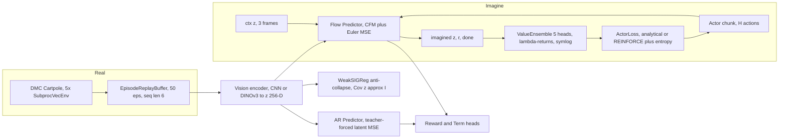
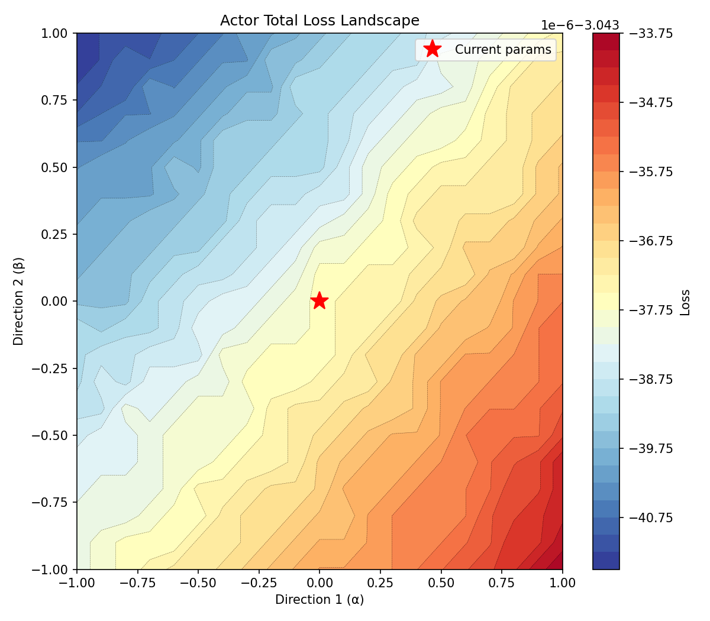
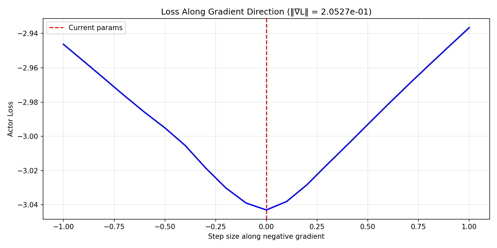
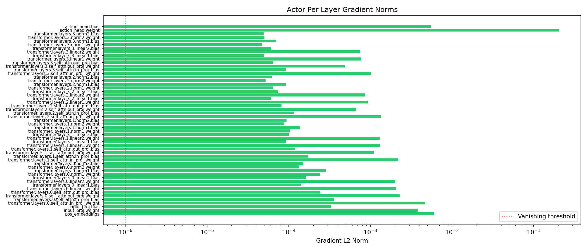
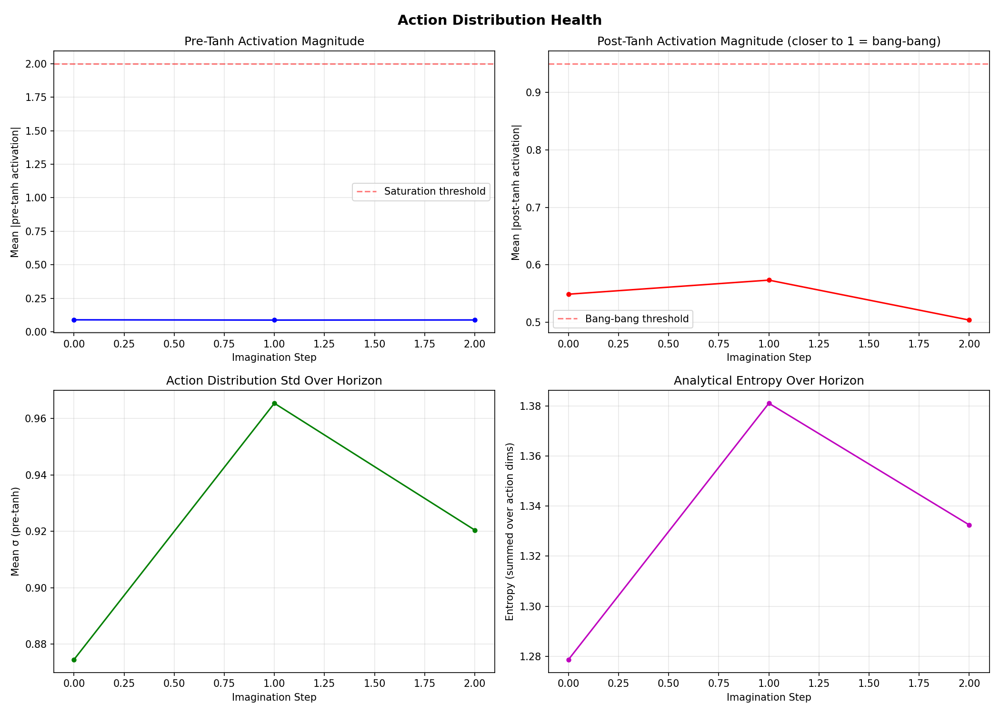
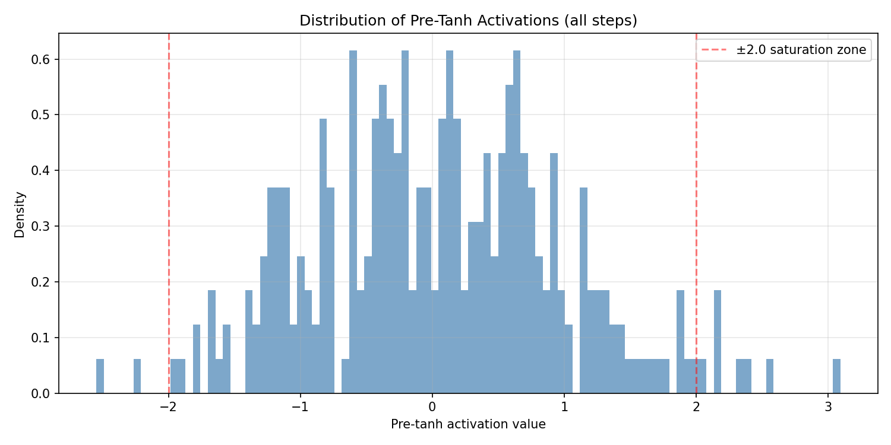
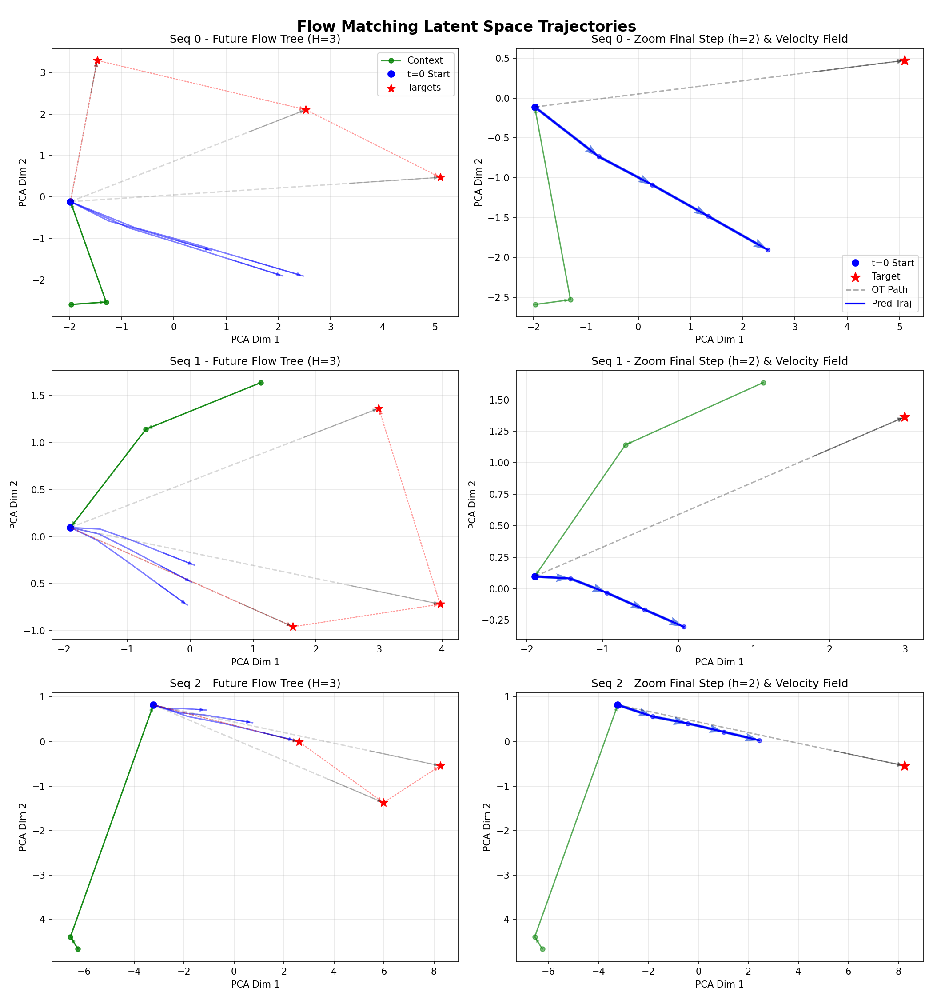
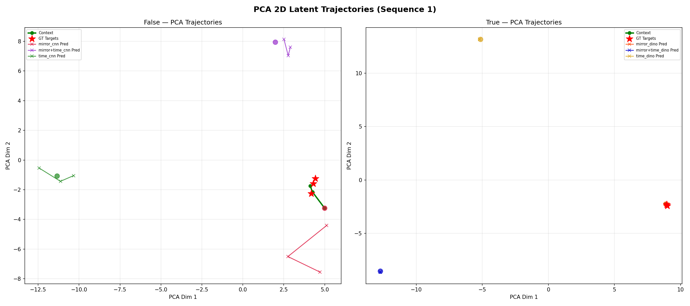
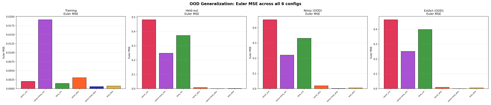
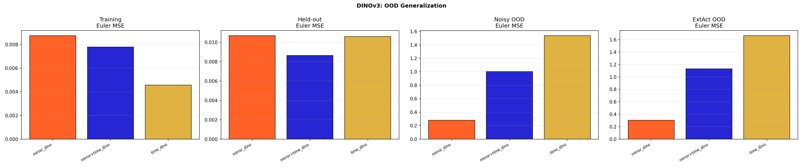

# Differentiable Flow World Models

> **LEWM — Latent Evolution World Model.**
> Experimental visual-control framework for studying policy optimization through differentiable flow-matching world models.

> **Can chunk-wise flow-matching world models provide useful policy gradients without the instability of long autoregressive BPTT?**
>
> Differentiable Flow World Models explores visual control by generating short latent future chunks with conditional flow matching and optimizing a Transformer policy by backpropagating λ-returns through the learned dynamics.

[](https://pytorch.org/)
[](https://www.dmc-mujoco.com/)
[]()
[]()

**TL;DR:** Differentiable Flow World Models investigates whether conditional flow matching can replace long autoregressive imagination when optimizing policies through a learned visual world model. A Transformer policy outputs action chunks, the world model generates corresponding latent futures, and λ-return gradients are backpropagated through those imagined trajectories. Short-horizon dynamics became predictable, but weak action conditioning and poor held-out generalization made the resulting analytical policy gradients unreliable. This repository documents the architectures, ablations, diagnostics, and failure modes explored along the way.

## Key findings

- Chunk-wise flow matching removed the need for an H-step sequential autoregressive rollout during imagination.
- Short-horizon latent predictions became plausible under the Cartpole setup.
- Learned dynamics remained weakly conditioned on actions and generalized poorly to held-out trajectories.
- As a result, analytical gradients through imagined trajectories were often poorly aligned with useful policy-improvement directions.
- Several attempted fixes — including longer horizons, alternative ODE solvers, entropy sweeps, DINOv3 features, and different value-learning schemes — did not resolve the underlying action-conditioning problem.

---

## Table of contents

- [Key findings](#key-findings)
- [1. Motivation](#1-motivation--why-flow-based-imagination)
- [2. How it works (30 seconds)](#2-how-it-works-30-seconds)
- [3. Repo layout](#3-repo-layout)
- [4. Quickstart](#4-quickstart)
- [5. Architecture in detail](#5-architecture-in-detail)
- [6. What works ✅](#6-what-works-)
- [7. What doesn't work / failed ❌](#7-what-doesnt-work--failed-)
- [8. Problems we faced (and fixes)](#8-problems-we-faced-and-fixes)
- [9. Experiment history](#9-experiment-history)
- [10. Diagnostics gallery](#10-diagnostics-gallery)
- [11. Config cheat-sheet](#11-config-cheat-sheet)
- [12. Branches](#12-branches)
- [13. Roadmap / open questions](#13-roadmap--open-questions)
- [14. Acknowledgements](#14-acknowledgements)

---

## 1. Motivation — why flow-based imagination?

Most Dreamer-style systems use the world model as a **proxy simulator**: roll out latent trajectories, then update the actor with a critic / REINFORCE objective that treats dynamics as a black-box data generator.

> **Research hypothesis:** generating future states as short flow-matched chunks may provide more stable long-horizon policy gradients than repeatedly backpropagating through an autoregressive dynamics model. If `d(return)/d(action)` can flow *through* `d(dynamics)/d(action)`, the actor gets dense, per-timestep feedback instead of a scalar score.

Note on Dreamer (verified): DreamerV1 backprops analytic value gradients through latent dynamics; DreamerV2/V3 keep stochastic backprop / reparameterization gradients for continuous actions and use REINFORCE for discrete actions (see DreamerV1 §Action model, DreamerV3 §Actor Learning, `torchrl.objectives.DreamerV3ActorLoss`). So the analytical path exists — this project pushes it further: make the *whole imagination operator* differentiable and stable enough that its gradients are actually usable.

Note on DreamerV4 (Hafner et al., `Training Agents Inside of Scalable World Models`, arXiv:2509.24527, Sep 2025): V4 replaces the RSSM/GRU with an efficient Transformer video world model trained with flow-matching + shortcut forcing, runs real-time on a single GPU, learns mostly from unlabeled video with little action-labeled data, and solves Minecraft diamonds purely offline in imagination. This validates the flow-modeling direction — but also sharpens the gap: V4 fixes weak action-conditioning with web-scale video + scale, while this project tests whether the same idea can survive on 50 Cartpole episodes under 4 GB VRAM.

Why this is hard with autoregressive (AR) dynamics — all three tried here:

1. **Full BPTT through AR dynamics → unstable long-horizon gradients.** Unrolling `z_{t+1}=f(z_t,a_t)` for H steps and backpropping compounds Jacobians. Small dynamics errors accumulate into unstable actor gradients. Repeated Jacobian products produced unstable actor gradients at longer horizons.
2. **Disconnected / stop-grad per step → too local.** Detaching each step stabilises training but each action only sees its immediate reward. No long-horizon credit. Tried, too myopic.
3. **Single-pass chunk generation → too hard to learn.** Predicting `[z_{t+1}..z_{t+H}]` in one forward pass removes BPTT, but the mapping is highly non-linear and the model never learned it. Tried, failed.

**Flow matching as the compromise:**

- Learn a velocity field `v_θ(z_t, t | ctx, actions)` that transports `last_context_state → future_states` in parallel.
- Generation is K Euler/RK4 steps along a near-linear OT path `(1-t)*z_0 + t*z_1`, not a deep recurrent chain.
- Hypothesis: the **linear nature stabilises grads**, and because every ODE step is action-conditioned, **every backprop timestep gives the actor feedback** — chaos mitigated without going fully local.

Concretely we want:

- **JEPA representation:** a vision encoder maps pixels → latents; predictor heads regress those latents against stop-grad encoder targets, so the representation is learned by latent prediction, not pixel reconstruction. `SIGReg` / `WeakSIGReg` (`‖Cov(z)−I‖_F`) acts as the anti-collapse regularizer. The pixel decoder is debug-only and excluded from the representation objective.
- **Pixels in, latents out:** tiny CNN (default) or frozen DINOv3 backbone → 256-D latent.
- **Two predictors, two jobs:**
  - `Dynamics` (AR Transformer predictor): teacher-forced next-latent prediction against detached encoder targets, grounds the encoder / reward / termination heads.
  - `FlowMatchingDynamics` (flow predictor): learns `v_θ(z_t, t | ctx, actions)` that transports `last_context_state → future_states` in parallel. Used for actor imagination.
- **Actor learns from imagination, not just real steps:** Transformer chunk-policy outputs `H` actions, world imagines `H` latents/rewards, λ-returns + entropy give an analytical loss. REINFORCE path kept as a reference.
- **Diagnose everything:** if analytical gradients are poorly aligned with the local objective, we want to *see* it — loss landscapes, finite-difference checks, per-layer grad norms, bang-bang monitors, PCA/flow trajectory plots, OOD comparisons.

Testbed is deliberately narrow: **DMC Cartpole `swingup` / `balance` from 64×64 pixels**, 5 parallel envs, horizon 3–15, **4 GB VRAM, ~50-episode buffer**. The deliberately constrained Cartpole setup serves as a controlled stress test for representation quality, action conditioning, and gradient stability under limited data and compute (see §8, §13).

---

## 2. How it works (30 seconds)



Training loop (`train.py:Trainer`):

1. **Prefill** 50 random episodes → **100 world-only bootstrap steps**.
2. Repeat 500 epochs:
   - collect 1 episode per env,
    - `train_world()`: JEPA latent prediction, AR plus flow predictors vs detached encoder targets, SIGReg anti-collapse, reward plus termination plus recon-debug plus real-value grounding,
   - `train_agent()`: imagine chunks with `world.generate_chunk()` in `flow` or `ar` mode, update value ensemble + actor,
   - `evaluate()`: deterministic rollout + TensorBoard video,
   - every 250 agent steps: full diagnostics dump to `runs/.../diagnostics/`.

---

## 3. Repo layout

```
.
├── train.py              # Config + Trainer (buffer, world/agent updates, rollout, eval)
├── losses.py             # SIGReg, WeakSIGReg, ValueLoss (λ-returns), ActorLoss, ReturnEMA
├── models/
│   ├── world.py          # World: vision + AR + flow + reward/term + generate_chunk/step_world
│   ├── dynamics.py       # Dynamics (AR) + FlowMatchingDynamics (Euler/RK4/Dopri5, CFG)
│   ├── agent.py          # Transformer chunk Actor + Value + ValueEnsemble (TD-MPC2 style)
│   ├── world_helpers.py  # VisionEncoder, DINOv3VisionEncoder, ActionEncoder, Reward, Termination, Decoder
│   ├── common.py         # ConditionalTransformer, FutureFlowBlock, RoPE, symlog/symexp
│   └── augmentations.py  # random_shift, color jitter, sensor noise, time_symmetry_aug
├── envs/
│   ├── dmc_wrapper.py    # DMCGym (pixels, termination on track limits)
│   └── helpers.py        # SubprocVecEnv + make_env
├── diagnostics/
│   ├── landscape.py      # 2D loss landscape + 1D gradient slice
│   ├── gradient_flow.py  # per-layer norms, cosine sim, finite-difference check
│   ├── action_monitor.py # bang-bang, entropy, pre/post-tanh, per-step profiles
│   ├── flow_diagnostics.py
│   └── ar_diagnostics.py
├── assets/               # curated images committed for this README
├── runs/                 # TensorBoard logs + diagnostics (gitignored, 100+ runs)
└── scratch/              # one-off probes, OOD studies, smoke tests (gitignored)
```

---

## 4. Quickstart

```bash
# env (example)
conda create -n lewm python=3.10 && conda activate lewm
pip install torch torchvision tensorboard tqdm gymnasium dm_control transformers torchdiffeq

# train (Cartpole swingup, flow imagination, defaults in train.py:Config)
python train.py

# TensorBoard
tensorboard --logdir runs

# diagnostics (auto-saved every 250 agent steps, or run manually)
python scratch/diagnose_actor.py --checkpoint ./runs/<run_dir>/checkpoint.pt
python scratch/read_losses.py
```

What you get in `runs/<domain>_<task>_analytical_ent..._seed42_<timestamp>/`:

- `events.out.tfevents.*` — all losses, grad norms, returns, videos (`Validation/Video`)
- `diagnostics/step_XXXX/` — `landscape_*.png`, `gradient_slice.png`, `action_distribution_health.png`, `flow_trajectories.png`, `finite_diff_check.png`, etc.
- `checkpoint.pt` (if enabled on your branch)

---

## 5. Architecture in detail

| Piece | File | Key choice |
|---|---|---|
| Vision CNN | `models/world_helpers.py:8` | 16→32→64 conv + BatchNorm + GAP → SwiGLU → LayerNorm, 256-D. Context encoder; targets are stop-grad encoder outputs |
| Vision DINOv3 | `models/world_helpers.py:59` | `facebook/dinov3-vits16-pretrain-lvd1689m`, frozen backbone, BatchNorm projection |
| AR predictor | `models/dynamics.py:12` | 6-layer AdaLN Transformer, causal, KV-cache for `step_world`. Predicts next latents vs detached targets (`train.py:829`) |
| Flow predictor | `models/dynamics.py:88` | 3-layer cross-attention `FutureFlowBlock`, RoPE, AdaLN-Zero, Euler/RK4/Dopri5, CFG, latent standardisation via `RunningMeanStd` |
| Reward / Term | `models/world_helpers.py:135,164` | SwiGLU MLPs; term is BCE-with-logits |
| Decoder (debug only) | `models/world_helpers.py:193` | ConvTranspose 4×4→64×64, MSE recon loss, visualises real vs Euler vs AR. Excluded from the JEPA representation objective |
| Actor | `models/agent.py:30` | Transformer chunk policy: ctx → 1 + H tokens → `Normal(mean, std)` → tanh squash, `H=world_horizon` |
| Value | `models/agent.py:185` | **5-head ensemble**, SwiGLU ResNet MLPs, dropout 0.01, min/mean reduction, symlog λ-returns |
| Anti-collapse regulariser | `losses.py:6,37` | JEPA: `SIGReg` (Epps-Pulley characteristic test) → cheaper `WeakSIGReg`: `‖Cov(z)−I‖_F` on encoder latents (`train.py:906`) |
| Augment | `models/augmentations.py` | sequence-consistent `random_shift(pad=3)`, colour jitter, sensor noise, 50 % time-reversal (`obs.flip + act.neg`) |

World training (`train.py:train_world`) — JEPA latent prediction:

- predictors regress detached encoder targets (no pixel reconstruction in the objective): AR loss = MSE to detached encoder targets, flow loss = `0.1 * (CFM velocity MSE + 0.02*cos)` + optional consistency `0.001 * MSE(view1, view2)`,
- `SIGReg` / `WeakSIGReg` anti-collapse on encoder latents, dynamics sees augmented views,
- clean labels for reward/term (never flipped by time-sym),
- reward grounding on real + AR-teacher-forced + flow-Euler states, term likewise,
- value grounding on real history windows with conservative min-target,
- per-loss grad-norm logging before the combined step.

Agent training:

- `world.generate_chunk(actions, start_states, imagination_mode='flow'|'ar')` — fully differentiable,
- value: smooth-L1 to λ-targets from target ensemble (τ=0.01),
- actor: `-γ^t * returns - entropy_scale * entropy`, analytical by default, REINFORCE optional.

---

## 6. What works ✅

- **World model trains.** Recon MSE drops, decoder visualisations track the pole, Euler and AR open-loop predictions are plausible for short horizons (`H=3`). This was *not* true at the start — see §8.
- **Flow matching is fast and parallel.** 4 Euler steps generate a whole chunk; flow matching predicts the future chunk in parallel across the horizon, avoiding H sequential autoregressive dynamics evaluations.
- **AR grounding stabilises representation.** Keeping a teacher-forced AR backend purely to train encoder/reward/term was one of the few unambiguous wins (dual-dynamics in `856b7ab`).
- **WeakSIGReg > SIGReg.** Full Epps-Pulley SIGReg was expensive and finicky; Frobenius `‖Cov−I‖` gives a spherical latent cloud for ~zero cost and is now the default (`weak_sigreg=True`).
- **Value ensemble helps.** TD-MPC2-style 5 heads, 2-sample min target, symlog + Huber loss killed the worst overestimation spikes. Single-head value was consistently optimistic.
- **Diagnostics actually diagnose.** Landscape / FD-check / action-monitor trio catches flat landscapes, stale gradients, and bang-bang collapse within minutes (see gallery below). Without them we'd still be guessing LR.
- **Small augmentations help generalisation.** Sequence-consistent `random_shift` + 50 % time-reversal improved held-out/OOD PCA separation; per-frame noise did not.
- **DINOv3 encoder runs.** Frozen ViT-S/16 + projection learns; useful as a reference, though not better than the tiny CNN on Cartpole.

---

## 7. What doesn't work / failed ❌

> Honest log — everything here cost at least one branch or a dozen runs.

| # | Tried | Result | Verdict |
|---|---|---|---|
| 1 | Pure analytical gradients through flow imagination | FD cosine often **< 0.5**, 1D slice doesn't descend along `-grad`, `flow_action_impact` flat | **Failing** — WM gradient misleads actor; action conditioning is weak |
| 1b | Full BPTT through AR dynamics | Unstable, exploding actor grads from compounded Jacobians | **Failed** — motivated chunk + flow |
| 1c | Disconnected stop-grad per step | Stable but too local, no long-horizon credit | **Failed** — too myopic |
| 1d | Single-pass chunk predictor (no ODE) | Mapping too non-linear, never learned | **Failed** — motivated flow matching |
| 2 | Flow-only world (no AR) | Trajectory collapse / mode averaging: all futures converge | **Failed** — needed dual dynamics |
| 3 | Non-causal flow + per-position `t` sampling | Future target leakage, unrealistically low loss | **Failed** — fixed by causal mask + per-sequence `t` |
| 4 | Training reward/term on Euler predictions | Garbage-in-garbage-out, heads never converge | **Failed** — train on encoder targets instead |
| 5 | Full SIGReg (1024 projections, 17 knots) | Slow, high-variance, marginal gain over weak version | **Replaced** by WeakSIGReg |
| 6 | CFG (dropout 0.15, scale >1) | No consistent gain on Cartpole, extra instability | **Disabled by default** |
| 7 | Custom discrete-VJP + torchdiffeq adjoint for memory | Correct but slow/complex; no actor gain | **Removed**, kept plain Euler/RK4/Dopri5 option |
| 8 | View-consistency loss | Helps slightly at `1e-3`, collapses if weighted higher | **Marginal / off by default** |
| 9 | REINFORCE in imagination | Higher variance but gradient direction sometimes *disagrees* with analytical | **Kept as diagnostic, not solution** |
| 10 | Long horizon `H=15` | Compounding error dominates, actor exploits hallucinations | **Failed** — `H=3` is the only stable setting |
| 11 | High entropy `0.03` to cure bang-bang | Prevents saturation but policy stays random | **Failed** — `0.006` is a compromise, not a fix |
| 12 | DINOv3 as drop-in replacement | Trains, but no win on 64×64 Cartpole, heavier + OOD quirks | **Neutral** |
| 13 | Time-symmetry on rewards/terms | Physically wrong (reward is not symmetric) | **Failed** — now applied to obs/act only, labels kept clean |
| 14 | Single value head + MSE | Optimistic, spikes, actor exploits overestimated imagined returns | **Replaced** by ensemble |
| 15 | LayerNorm in vision projection | Dead latents on small batches | **Replaced** by BatchNorm1d |

**Blunt summary:** the world learns to *predict*; the actor hasn't learned to *act* reliably. Swingup returns plateau far below model-free baselines, and many runs end in tanh saturation (bang-bang).

---

## 8. Problems we faced (and fixes)

**Core open doubt: is the flow model learning anything?** Current evidence says *overfitting, not generalising*:

- train (CFM velocity) loss goes low, but decoder **reconstruction looks bad**,
- OOD PCA / `ood_comparison.png` is bad — held-out sequences separate poorly,
- **loss spikes every time the 50-episode buffer fills** and a new episode pushes an old one out (non-stationary tiny data),
- `flow_action_impact.png` is **flat**: varying actions barely moves predicted latents — action conditioning is weak, so actor gradients have nothing to bite on.

**Objective mismatch (velocity vs representation).** Flow trains the dynamics to match `v* = z_1 - z_0`, while the encoder must simultaneously learn *meaningful* `z` itself. The two objectives pull in different directions: a velocity that is easy to fit need not come from a representation that is useful for reward/value. This is unsolved here.

**Multivariate collapse on tiny data + 4 GB VRAM.** With 64×64 Cartpole, batch 96, seq-len 6, latent 256-D, and only ~50 episodes live at once, `Cov(z)` collapses to a thin manifold. WeakSIGReg (`‖Cov−I‖_F`) only partially fixes it — it sphericalises the cloud but doesn't create semantic structure. Hard constraints stated explicitly: **4 GB VRAM caps model/buffer/horizon size, and the tiny-data regime is the experiment, not just a limitation.**

**Bang-bang collapse.** Pre-tanh magnitudes > 2.0 → `tanh` saturates → post-tanh ≈ ±0.95, action std < 0.01. Entropy sweeps (`0.003 → 0.006 → 0.03`, see `runs/` names) only move the failure point. ReturnEMA normalisation and analytical entropy were added (`losses.py:241`, `models/agent.py:144`) but didn't cure it.

**Analytical vs true gradient.** `diagnostics/gradient_flow.py` finite-difference check routinely shows cosine < 0.5. The 1D `gradient_slice.png` is flat or ascends along the negative gradient — the WM is either too sharp or too wrong at imagined points. This is why `reinforce=True` and ReturnEMA paths still exist: to compare.

**Mode averaging / trajectory collapse.** Early flow model predicted the *mean* future regardless of action (`66fe00a`). Fix required three simultaneous changes (`87deeef`): causal attention, single `t` per sequence (not per position), additive action conditioning. Any one alone wasn't enough.

**Target leakage.** With `flow_causal=False` the model could peek at future targets during training. Loss looked great, imagination was useless. Fixed in `c78b5a9` / `bafaf1c` by enforcing causal masks and refactoring horizons (`imagination_ctx_frames` vs `world_horizon`).

**Train/infer mismatch.** AR was trained teacher-forced in parallel but rolled out one-shot (`5bc45c9`). Added `step_world` KV-cache rollout and open-loop AR visualisation so train and eval actually compare the same thing.

**Reward/term on hallucinations.** Euler predictions early in training are noise; training heads on them (`a6e8581` before fix) poisons them permanently. Now heads train on detached encoder targets + grounded flow endpoints with aligned slicing.

**Double discount bug.** Returns were discounted twice (once in λ-returns, once in actor weighting). Fixed in `1bd40eb` — returns jumped discontinuously, which tells you how long we'd been tuning around a bug.

**Latent collapse.** Without regularisation, encoder collapses to a thin manifold. Full SIGReg worked but was overkill; WeakSIGReg (`‖Cov−I‖_F` with 64-D sketch) is the pragmatic fix now defaulted on.

**Termination semantics.** Cartpole hitting track limits was truncated, not terminated, so values bootstrapped through walls. Added `terminate_on_limit` in `DMCGym` + termination head (`6f558c6`, `56fc096`).

**History-window slicing.** Off-by-one in `_get_history_windows` fed the actor stale context. Fixed in `16c2a22` along with conditional source noise.

**Solver / memory rabbit hole.** Custom adjoint VJP + `torchdiffeq` tuple-state (`54578bf`, `f0930dc`) saved memory but added complexity without actor improvement. Removed custom adjoint; kept `euler` default with `rk4`/`dopri5` as options.

---

## 9. Experiment history

Condensed from `git log` (oldest → newest). Each line was a hypothesis:

- `e619704` world model finally training — first recon that isn't noise
- `ee67239` greedy analytical gradients “working” (short-horizon, low bar)
- `cf0aa6b` REINFORCE in imagination added as sanity check
- `eb60406` Transformer actor + value-MSE experiment
- `5bc45c9` fixed AR train/infer mismatch + added loss-landscape diagnostics
- `792266a` replaced Transformer dynamics with flow matching
- `a6e8581` reward/termination heads trained on inaccurate early Euler predictions moved to encoder targets
- `66fe00a` documented trajectory collapse → `87deeef` fixed mode averaging
- `856b7ab` dual dynamics (AR grounds, flow imagines)
- `3a4964c` CFG + latent standardisation → `444a1f8` fixed disconnected init → `c78b5a9` fixed causal leakage
- `54578bf` / `f0930dc` adjoint solvers + RK4/Dopri5, then removed custom adjoint
- `bafaf1c` horizon refactor + leakage/CFG fixes
- `8d9cf78`–`cb30cc0` dual-dynamics cleanup
- `16c2a22`–`6f558c6`–`56fc096` history-window + Cartpole termination + freeze_world
- `8dc8932` CFM/Euler hybrid + augmentations + view consistency → `ccb568e` time-symmetry → `b0cd014` time-sym fixes → `1bd40eb` double-discount fix
- `ef83672` DINOv3 encoder → `0577348` removed over-complex value suppression → `f23c265` LayerNorm→BatchNorm → `a49fb65` PCA diagnostics → `58b945c`/`1fd5c5f` TD-MPC2 value ensemble (current `feature/grounded-value`)

Naming convention in `runs/` encodes the sweep: `cartpole_swingup_analytical_ent0.006_alr8e-05_..._wh3_ah3_sig0.01_weaksig_seed42_<timestamp>` — ~100 runs varying `entropy`, `world_horizon (wh)`, `sigreg`, `task`.

---

## 10. Diagnostics gallery

All images below are real outputs committed under `assets/` (originals live gitignored under `runs/.../diagnostics/` and `scratch/ood_v3/`).

**Actor loss landscape (should be a smooth valley — flat = WM gives no signal, chaotic = LR too high):**



**1D slice along `-grad` (loss should descend — if not, gradient is stale/buggy):**



**Per-layer grad norms (red / zero bars = vanishing):**



**Action health — bang-bang detector (pre-tanh > 2.0 or post-tanh > 0.95 = saturated):**




**Flow imagination in PCA space (collapsed trajectories = mode averaging):**




**OOD / encoder comparison (CNN vs DINOv3, held-out sequences):**




> Regenerate: run training, then `tensorboard --logdir runs` for `Validation/Video` + curves, and open `runs/<run>/diagnostics/step_*/`.

---

## 11. Config cheat-sheet

All in `train.py:Config`. The ones that actually matter:

| Flag | Default | Note |
|---|---|---|
| `domain/task` | `cartpole/swingup` | `balance` is easier, good smoke test |
| `imagination_mode` | `flow` | `ar` is slower but useful ablation |
| `world_backend / world_training` | `('flow',)` | add `'ar'` to enable dual dynamics |
| `world_horizon` | `3` | `6`/`15` tried, unstable |
| `imagination_ctx_frames` | `3` | min real frames before imagining |
| `flow_num_euler_steps` | `4` | more steps = slower, not better |
| `flow_loss_weight / flow_vel_cos_weight` | `0.1 / 0.02` | main dynamics knobs |
| `flow_training_method` | `cfm` | `euler` or `both` also supported |
| `flow_use_shift / flow_use_time_sym` | `True` | the two augmentations that helped |
| `flow_use_consistency / weight` | `False / 0.001` | keep off unless experimenting |
| `use_sigreg / sigreg_weight / weak_sigreg` | `True / 0.01 / True` | WeakSIGReg is the stable default |
| `entropy_scale` | `6e-3` | `3e-3` collapses, `3e-2` random — no sweet spot found |
| `actor_lr / value_lr / world_lr` | `8e-5 / 8e-5 / 1e-3` | world LR 10× agent LR is intentional |
| `num_value_heads / value_subset_size` | `5 / 2` | TD-MPC2 min-pair target |
| `discount / return_lambda` | `0.99 / 0.99` | λ-returns in symlog space |
| `use_termination / env_terminate_on_limit` | `True` | needed for Cartpole walls |
| `vision_encoder` | `cnn` | `dinov3` available, heavier |
| `diag_every_n_steps` | `250` | landscape grid `21`, FD params `20` |

---

## 12. Branches

| Branch | Purpose |
|---|---|
| `main` | stable-ish baseline |
| `feature/grounded-value` *(current)* | value ensemble + grounded real-value loss |
| `feature/dual-dynamics` | AR + flow side-by-side |
| `feature/flow-matching-dynamics` | early flow-only experiments |
| `debug/actor-loss-landscape` | landscape / grad-flow / action-monitor toolkit |
| `chunked` | chunked actor rollout |
| `reinforce` | REINFORCE reference path |

If you're new, start from `feature/grounded-value` and diff against `main` — the diff is mostly simplification + ensemble.

---

## 13. Roadmap / open questions

1. **Is flow learning or memorising?** Add the missing test: action-sensitivity curves (sweep one action dim, measure `‖dz/da‖`), held-out-episode velocity error vs train error, and recon quality vs buffer age. If train-low / OOD-high persists, flow is overfitting the 50-ep buffer.
2. **Fix the velocity↔representation mismatch.** Options: freeze encoder while flow warms up (or vice versa), auxiliary contrastive / predictive encoder loss independent of velocity, or distill flow targets from AR (`flow_distill_from_ar`) — all currently inconclusive.
3. **Fix or abandon analytical gradients?** FD-check says the flow WM gradient is unreliable. Next tries: shorter `H=1` sanity, gradient penalties, or full REINFORCE/PG baseline.
4. **Value grounding is incomplete.** Real-state grounding exists; imagined-state calibration + proper termination-aware λ-returns still suspect.
5. **Entropy isn't the answer to bang-bang.** Need tanh-aware init, action-penalty, or bounded-noise policies.
6. **Scale beyond Cartpole?** No — not until swingup is solved reliably from pixels with `H=3` under 4 GB / 50-episode constraints.
7. **DINOv3 + time-symmetry + consistency interaction** is untested jointly; current defaults are the minimal stable set.
8. **Videos over curves.** `Validation/Video` in TensorBoard is still the fastest way to tell if a run is real — add GIF export so READMEs like this can show motion.

---

## 14. Acknowledgements

Built on DeepMind Control Suite, PyTorch, and ideas from DreamerV3 (RSSM → latent imagination, symlog, entropy), DreamerV4 (Transformer video world model, flow-matching + shortcut forcing, offline imagination at scale — see arXiv:2509.24527), TD-MPC2 (value ensemble, min-pair target), and conditional Flow-Matching (parallel chunk generation). Diagnostics inspired by standard loss-landscape and gradient-flow visualisation practices. All failures are our own.

---

*This repository documents both successful components and unresolved failure modes. Short-horizon world prediction became workable, but reliable action-conditioned imagination and policy optimization remain open problems. If you fix §7 row 1, please update this file first.*
